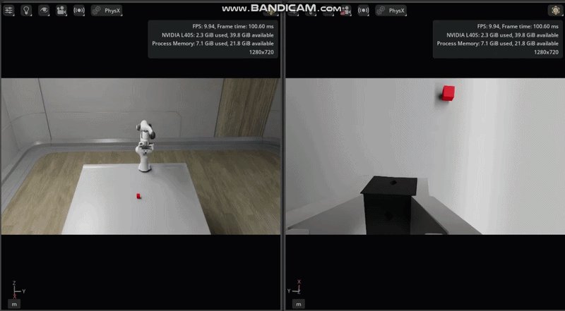

# Isaacsim_pick_place



Isaac Sim 위에서 Franka Panda 로봇으로 물체를 인식하고 집어서(pick) 다른 위치에 놓는(place) ROS 2 패키지입니다. MoveIt 2 기반 모션 계획과 `ros2_control`(`topic_based_ros2_control`)을 통해 Isaac Sim과 통신합니다.

## 구성

| 파일 | 설명 |
|---|---|
| `object_detector.py` | RGB(+Depth) 이미지에서 물체를 검출해 3D 위치와 회전각(yaw)을 `panda_link0` 기준으로 계산, `/detected_object_pose`로 발행 |
| `object_detector_cloud.py` | Depth 이미지 대신 `PointCloud2`(organized)에서 직접 3D 좌표를 읽는 대체 버전 |
| `pick_and_place.py` | `/detected_object_pose`를 구독해 MoveIt IK로 접근→하강→파지→이동→배치 시퀀스를 실행 |
| `scene_describer.py` | 카메라 영상을 Ollama의 비전 모델(Gemma 3)로 보내 장면을 한국어로 설명, `/scene_description`으로 발행 |

## 요구 사항

- ROS 2 Humble
- MoveIt 2 (`moveit_resources_panda_moveit_config` 등)
- `ros2_control`, `ros2_controllers`, `topic_based_ros2_control`
- Isaac Sim (ROS 2 Bridge, Action Graph로 카메라/조인트 상태 발행)
- Python: `opencv-python`, `numpy<2`, `ultralytics`(YOLO, 선택), `cv_bridge`
- `scene_describer.py` 사용 시: 별도로 `ollama serve` 실행 + `ollama pull gemma3:4b`

> **주의**: `pip install ultralytics`는 `numpy`, `setuptools`를 최신 버전으로 올려 `colcon build`(`ament_cmake_python`)와 `cv_bridge`를 깨뜨릴 수 있습니다. `numpy<2`, `setuptools<80`을 유지하거나, YOLO/PyTorch 관련 패키지는 별도 가상환경(venv)에 분리 설치하는 것을 권장합니다.

## 빌드

```bash
cd ~/ros2_ws
colcon build --symlink-install
source install/setup.bash
```

## 실행

### 1. MoveIt + Isaac Sim 연동 (RViz)

```bash
ros2 launch moveit_resources_panda_moveit_config demo.launch.py \
  ros2_control_hardware_type:=isaac use_sim_time:=true
```

Isaac Sim을 Play 상태로 켜고, ROS2 Bridge Action Graph(조인트 상태 `/isaac_joint_states`, 명령 `/isaac_joint_commands`, TF, 카메라 등)가 정상 발행 중인지 먼저 확인하세요.

### 2. 물체 인식 (`object_detector`)

HSV 색상 기반(예: 빨간 정육면체) 검출:

```bash
ros2 run panda_pick_place object_detector --ros-args \
  -p use_sim_time:=true \
  -p color_topic:=/rsd455/color/image_raw \
  -p depth_topic:=/rsd455/depth/image_raw \
  -p camera_info_topic:=/rsd455/camera_info \
  -p base_frame:=panda_link0 \
  -p use_color_fallback:=true \
  -p cube_height:=0.04
```

YOLO(seg) 기반 검출로 전환하려면 `use_color_fallback:=false`로 두고 커스텀 학습된 `*-seg.pt` 가중치를 `model_path`로 지정하세요(기본 COCO 사전학습 모델에는 "정육면체" 클래스가 없어 검출되지 않습니다).

### 3. Pick & Place 실행

```bash
ros2 run panda_pick_place pick_and_place --ros-args \
  -p use_sim_time:=true \
  -p place_dx:=0.1
```

### 4. 장면 설명 (`scene_describer`, 선택)

카메라 영상을 Ollama의 비전 모델로 보내 장면에 어떤 물체가 있는지 설명받을 수 있습니다. 먼저 Ollama 서버를 띄우고 모델을 받아야 합니다.

```bash
ollama serve                 # 별도 터미널에서 계속 실행 중이어야 함
ollama pull gemma3:4b        # 최초 1회
```

그 다음 노드를 실행합니다.

```bash
ros2 run panda_pick_place scene_describer --ros-args \
  -p model:=gemma3:4b \
  -p image_topic:=/rsd455/color/image_raw \
  -p max_width:=320 \
  -p describe_period:=30.0 \
  -p timeout:=120.0 \
  -p prompt:="List the objects on the table. For each, give its color, position (left/center/right), and shape. Be concise."
```

`describe_period`마다(또는 `/describe_trigger` 토픽으로 즉시) 카메라 프레임 1장을 모델에 보내고, 결과를 `/scene_description`(String)으로 발행합니다. 예시 출력:

```
Here's a breakdown of the objects visible in the image:
- **Black Cube:** Center, Cube
- **Black Cube:** Left, Cube
- **Red Cube:** Right, Cube
```

> 첫 요청은 모델 로딩 때문에 응답이 느릴 수 있습니다(GPU 없이 CPU로 돌리면 특히). 로그에 `이전 요청 처리 중 — 건너뜀`이 반복되면 아직 첫 응답을 기다리는 중일 가능성이 높으니, `ollama run gemma3:4b`로 별도 테스트해 응답 속도를 먼저 확인해보세요.

## 주요 파라미터

### `object_detector.py`

| 파라미터 | 기본값 | 설명 |
|---|---|---|
| `cube_height` | `0.04` | Depth는 물체 윗면까지의 거리만 측정하므로, 실제 물체 중심 좌표로 보정하는 데 쓰는 높이(m) |
| `camera_yaw_sign`, `camera_yaw_offset_deg` | `1.0`, `0.0` | 이미지 평면 회전각 → `base_frame` yaw 변환 시 카메라 마운트 방향에 따른 보정값 |
| `use_color_fallback` | `False` | `True`면 HSV 색상 기반 검출(`hsv_low`/`hsv_high`), `False`면 YOLO 모델 사용 |

### `pick_and_place.py`

| 파라미터 | 기본값 | 설명 |
|---|---|---|
| `place_dx` | `0.2` | 집은 물체를 X축 방향으로 옮겨 놓을 거리(m). Panda의 최대 도달 반경(~0.855m)을 넘지 않도록 물체 위치에 맞게 조정 필요 |
| `approach_height` | `0.15` | 파지 전/후 접근 높이(m) |
| `grasp_z_offset` | `0.10` | 파지 시 Z축 오프셋(m) |
| `gripper_yaw_offset` | `0.0` | `panda_link8` 기준 yaw와 실제 그리퍼 손가락 방향 사이의 고정 보정값(도). Franka Panda 손목 구조상 필요할 수 있음 |

## 동작 방식 메모

- **그리퍼 파지**: 뎁스 카메라가 측정하는 값은 물체 "윗면"까지의 거리이므로, `cube_height/2`만큼 보정해 물체 중심을 추정합니다.
- **회전 정렬**: 물체의 회전각(yaw)을 `cv2.boxPoints()` 기반으로 계산(OpenCV 버전에 안전)하고, 정사각형 대칭(90도 주기)을 활용해 접근/하강/들기 전 구간에 동일한 파지 각도를 고정 사용합니다.
- **그리퍼 안정화 대기**: 액션 서버의 완료 응답 시점과 Isaac Sim 물리 시뮬레이션이 실제로 안정되는 시점이 다를 수 있어, `/joint_states`를 직접 폴링해 목표 위치 근처에서 안정될 때까지 대기합니다.
- **홈 위치 복귀**: 시퀀스 시작 시 관절 각도를 저장해두고, 성공/실패와 무관하게 종료 시 해당 자세로 복귀합니다.

## 알려진 이슈 / 트러블슈팅

- **RViz Plan은 되는데 Execute가 이상하게 움직임**: eye-in-hand 카메라 등 Isaac Sim에 추가한 오브젝트에 Rigid Body(PhysX) 속성이 남아있으면 그리퍼 근처에서 물리 간섭을 일으킬 수 있습니다. 순수 센서 용도의 prim은 Rigid Body/Mass 속성을 제거하세요.
- **카메라 TF가 로봇 움직임을 따라가지 않음**: Isaac Sim Action Graph의 `ROS2 Publish Transform Tree` 노드에서 `Static Publisher`가 꺼져 있는지, `Target Prims`에 카메라 prim이 포함되어 있는지 확인하세요.
- **`colcon build`가 `ament_cmake_python`에서 실패**: `pip install ultralytics`로 `setuptools`가 올라간 경우입니다. `pip install "setuptools<80,>=30.3.0"` 후 `packaging` 버전도 확인하세요.
- **`cv_bridge`에서 `_ARRAY_API not found`**: `numpy<2`로 고정하세요.

## 로드맵

현재는 Isaac Sim 시뮬레이션(Panda + RealSense D455) 기반으로 개발되었으며, 이후 실제 로봇(UR5e + OnRobot RG6 그리퍼 + 단안 웹캠) 환경으로 전환하는 작업이 별도로 진행 중입니다.
